# Steam Games Success Analysis

- R-based statistical analysis of paid Steam games using Kaggle's Steam Games Dataset 2025.
- This project focuses on reviews, price, genre, playtime, and multiplayer features.
- This was my Introduction to Probability and Statistics final project.

## Goal

- The main goal of this project was to determine which variables best predict or relate to the commercial success of paid Steam games.
- Our composite success metric was defined as the product of total review count and price.
- `success_score = num_reviews_total * price`

## Dataset

- The dataset used in this project was the Steam Games Dataset 2025 from Kaggle.
- Dataset link: https://www.kaggle.com/datasets/artermiloff/steam-games-dataset
- For this analysis, we restricted our dataset to games with:
  - Metacritic score > 0
  - Price > 0
  - Median playtime > 0
  - Average playtime > 0
- After filtering the data, our sample included 1,557 paid games.

## Research Questions

- Q1. Is the Metacritic critic score or the Steam user-review percentage a better single predictor of success?
- Q2. Does combining both scores meaningfully improve prediction over the better single predictor?
- Q3. Are some genres systematically associated with higher success after controlling for other genre tags?
- Q4. Is higher price positively correlated with success?
- Q5. Is median playtime or average playtime the better predictor of success?
- Q6. Do multiplayer games achieve higher success than single-player games?
- Q7. Is price efficiency, measured as median hours per dollar, associated with success?

## Variables Used

- `metacritic_score`: critic score of the game
- `pct_pos_total`: percentage of positive Steam user reviews
- `price`: price of the game
- `num_reviews_total`: total number of user reviews
- `median_playtime_forever`: median playtime in minutes
- `average_playtime_forever`: average playtime in minutes
- `genres`: genre tags for each game
- `categories`: category tags used to identify multiplayer games

## Derived Variables

- `success_score = num_reviews_total * price`
- `log_success`: logged version of success score
- `price_efficiency = median_playtime_forever / price`
- `log_price_efficiency`: logged version of price efficiency
- `log_num_reviews`: logged version of total reviews
- `player_mode`: multiplayer or single-player classification
- Genre indicator variables for Action, Adventure, Casual, Indie, RPG, Simulation, Strategy, Sports, and Racing

## Methods

- All analysis was conducted in R using `tidyverse`, `dplyr`, `ggplot2`, `broom`, and base R statistical functions.
- The analysis used:
  - Data cleaning and filtering
  - Exploratory data visualization
  - Simple linear regression
  - Multiple linear regression
  - Regression diagnostics
  - Welch two-sample t-test
  - Spearman correlation

## Findings

- Metacritic critic score was a stronger single predictor of success than Steam user-review percentage.
- Combining Metacritic score and Steam user-review percentage improved prediction, but only modestly.
- Simulation, Action, and RPG games were associated with higher success after controlling for overlapping genre tags.
- Indie-labeled games were associated with lower success after controlling for other genre tags.
- Higher-priced games were positively correlated with success, although this should be interpreted carefully because price is part of the success score formula.
- Average playtime was a better predictor of success than median playtime.
- Multiplayer games had higher average log success scores than single-player games.
- Price efficiency had little meaningful relationship with success.

## Visualizations
### Metacritic Score VS. Success Score
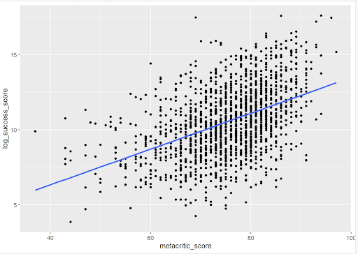
### User Score VS. Success Scorer

### Metacritic Score VS. User Score 
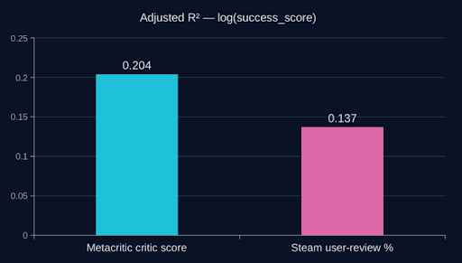
### Combining Both Predictors
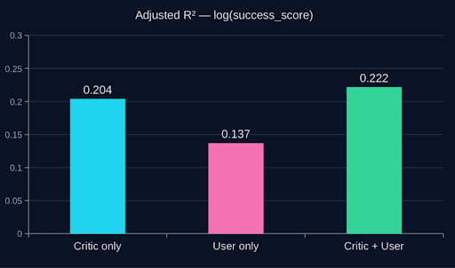
### Genre Effects on Success
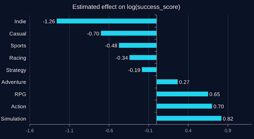
### Higher Price Correlates With Greater Success
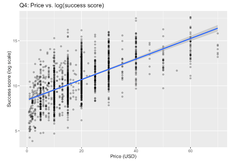
- Pearson's r: 0.639
- Slope (per $): 0.114
- Std. Error: 0.003
- P-value: < 0.001
- Adjusted R²: 0.408
### Higher Price Correlates With More Reviews
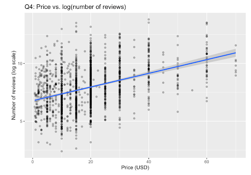
- Pearson's r: 0.404
- Slope (per $): 0.059
- Std. Error: 0.003
- P-value: < 0.001
- Adjusted R²: 0.163
- Likely reflects budget-quality correlation.

### Median Playtime VS. Success Score
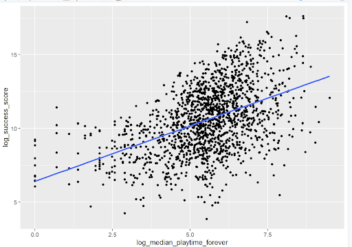
- Adjusted r square of log median playtime as predictor of success is 0.2155027
### Average Playtime VS. Success Score
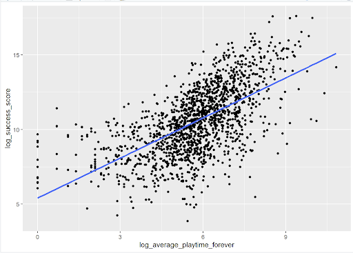
- Adjusted r square of log average playtime as predictor of success is 0.3785012
### Multiplayer games beats Single-player games
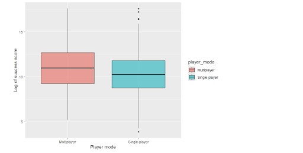
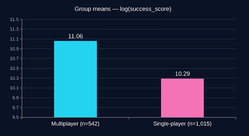
### Price Efficiency Has Very Little Correlation With Success
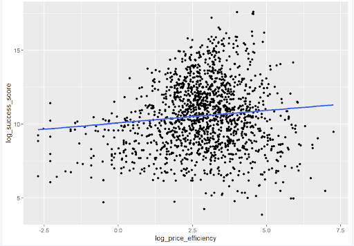
- Spearman’s ρ: 0.073
## Limitations

- The price effect should be interpreted carefully because price is part of the success score formula.
- The sample only includes paid games with Metacritic scores and nonzero playtime.
- The findings should not be generalized to all Steam games.
- Free-to-play games and many unrated indie games are excluded.
- The dataset is a single time-point snapshot.
- The models may not fully detect nonlinear relationships or price ceilings.

## Files

- `steam_games_analysis.Rmd`: R Markdown file containing the analysis code
- `final_project_paper.pdf`: final written project report
- `README.md`: information about the project

## Reproduce the Analysis

- Download the Steam Games Dataset 2025 from Kaggle.
- Create a folder called `data`.
- Place the cleaned CSV file inside the `data` folder.
- Name the file `games_march2025_cleaned.csv`.
- Open `steam_games_analysis.Rmd` in RStudio.
- Run or knit the file.

## Skills Demonstrated

- R programming
- Data cleaning
- Data visualization
- Regression modeling
- Hypothesis testing
- Statistical interpretation
- Working with real-world data
- Communicating results through a written report

## Contributors

- Mikey Pole
- Augie Jones
- Luis Jiang
